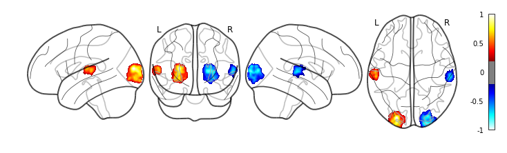
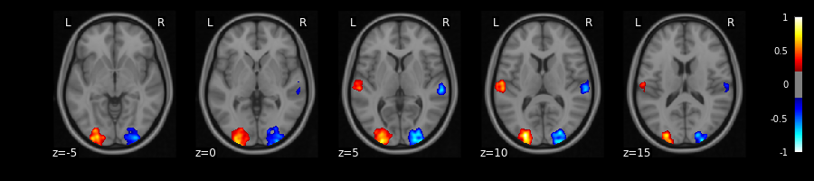
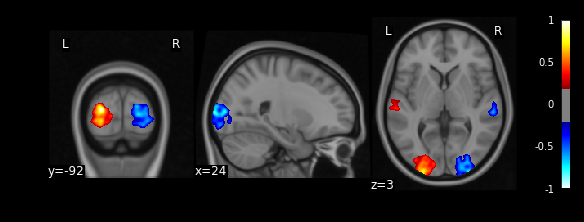

# Create fake fMRI results

[](https://circleci.com/gh/miykael/create_fake_fmri_results/tree/master)
[](https://github.com/miykael/create_fake_fmri_results/issues/)
[](https://github.com/miykael/create_fake_fmri_results/pulls/)
[](https://GitHub.com/miykael/create_fake_fmri_results/graphs/contributors/)
[](https://github.com/miykael/create_fake_fmri_results/commits/master)
[](https://github.com/miykael/create_fake_fmri_results/archive/master.zip)
[](https://hub.docker.com/r/miykael/create_fake_fmri_results/)
[](http://hits.dwyl.io/miykael/create_fake_fmri_results)


This jupyter notebook allows you to create some fake fMRI results that you can use for a tutorial or class. The only thing that you have to do is to specify where you want to insert a fake cluster, the extent of such a cluster and the intenstiy (i.e. positive or negative).

# Run it online in your browser

You can run the notebook directly on [mybinder.org](mybinder.org) by clicking on the following button: [](http://mybinder.org/repo/miykael/create_fake_fmri_results)

# Results

After running the notebook you will get figures, like the ones you see below, as well as peak information according to two probability atlases.

### Glass brain view



### Slice view



### Orthogonal view at a specific location


### Atlas information
```
Cluster 01
==========
  Size = 12819 voxels
  Peak Value: -0.84

Peak Information at [23.0, -99.0, 7.0]:
HarvardOxford                   63% Occipital_Pole
Juelich                         49% GM_Visual_cortex_V1_BA17_R
Juelich                         46% GM_Visual_cortex_V2_BA18_R
Juelich                         29% WM_Optic_radiation_R
Juelich                         19% GM_Visual_cortex_V3V_R
```
